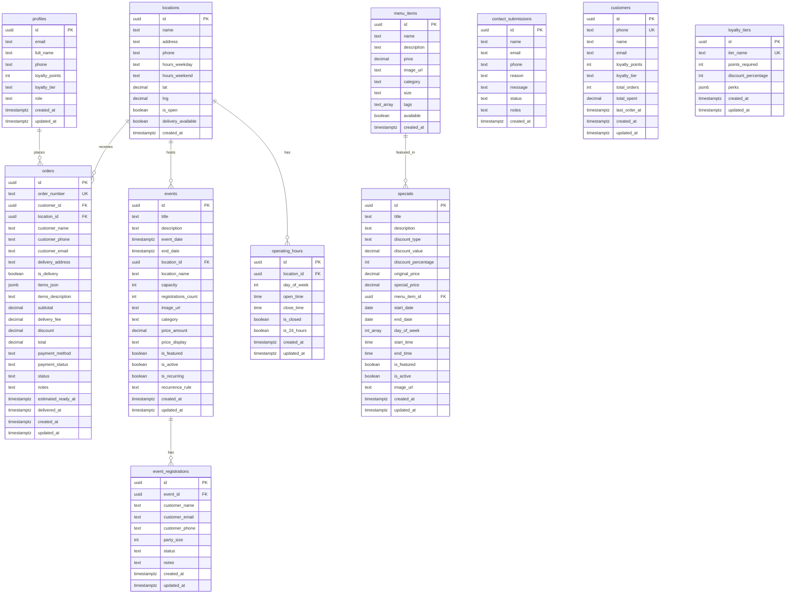

# Simmer Down - Entity Relationship Diagram

## Full Schema ERD

## Simplified Core Relationships

## Data Flow Diagrams

### Event Registration Flow

### Order Completion Flow

## Table Dependencies (for migration order)

## Access Control Matrix

| Table | Public Read | Public Insert | User Read Own | User Update Own | Admin Full |
|-------|-------------|---------------|---------------|-----------------|------------|
| profiles | ✓ | ✗ | ✓ | ✓ | ✓ |
| menu_items | ✓ | ✗ | ✓ | ✗ | ✓ |
| locations | ✓ | ✗ | ✓ | ✗ | ✓ |
| orders | ✗ | ✓ | ✓ | ✗ | ✓ |
| contact_submissions | ✗ | ✓ | ✗ | ✗ | ✓ |
| events | ✓ (active) | ✗ | ✓ | ✗ | ✓ |
| event_registrations | ✗ | ✓ | ✓ | ✗ | ✓ |
| specials | ✓ (active) | ✗ | ✓ | ✗ | ✓ |
| operating_hours | ✓ | ✗ | ✓ | ✗ | ✓ |
| customers | ✗ | ✓ | ✓ | ✗ | ✓ |
| loyalty_tiers | ✓ | ✗ | ✓ | ✗ | ✓ (admin only) |

## Index Coverage Map

## Trigger Flow

## Schema Versioning

## Query Pattern Analysis

## Performance Optimization Zones

## Realtime Channels

---

**Viewing Instructions:**

This ERD uses Mermaid syntax. To view:

1. **GitHub**: Auto-renders in markdown preview
2. **VS Code**: Install "Markdown Preview Mermaid Support" extension
3. **Online**: Paste in https://mermaid.live/
4. **Documentation Tools**: Most support Mermaid natively (GitBook, Notion, etc.)

**Legend:**
- `PK` = Primary Key
- `FK` = Foreign Key
- `UK` = Unique Key
- `||--o{` = One to Many relationship
- `}o--o{` = Many to Many relationship
- `-.->` = Reference/Soft relationship
